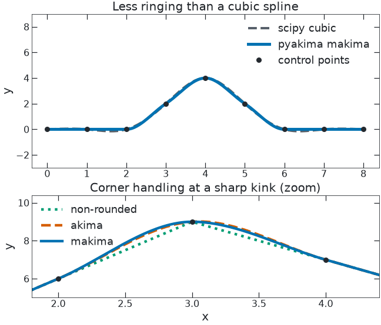

# pyakima

[](https://pypi.org)
[](https://opensource.org/licenses/Apache-2.0)
[](https://github.com/mcdigman/pyakima/actions/workflows/test.yml)
[](https://github.com/mcdigman/pyakima/actions/workflows/coverage.yml)
[](https://github.com/mcdigman/pyakima/actions/workflows/typecheck.yml)


`pyakima` is a fast, JIT-compatible Akima spline implementation written in
pure Python.

Akima splines are a type of cubic spline that guarantees continuous differentiability and local behavior while minimizing overshoot on both regular and irregular interpolation grids.
`pyakima` ships a small object-oriented Python API for ordinary use and
Numba-friendly helper functions for building and evaluating splines inside
fully jitted code.

The implementation is fully typed (`py.typed`) and keeps the public surface
small:
`AkimaSpline` is an object-oriented interface which simplifies calls for non-jitted Python callers; it has only a constructor and a `__call__` method.
For jitted workloads,
1. The spline interpolation itself are represented as knots stored in a `SplineCoeffs` object, computed once via `akima_create_helper`.
2. The spline is called from `cubic_call`, which selects the appropriate knot and evaluates the polynomial with `spline_single_knot_eval`.

<picture>
  <source media="(prefers-color-scheme: dark)" srcset="assets/akima_demo_dark.gif">
  
</picture>

The top panel slides one control point up and down: the pyakima `makima` fit
stays local and flat on either side of the spike, while a natural cubic spline
rings above and below it. The bottom panel zooms into a sharp kink to show the
three corner models `pyakima` exports:
1. `non-rounded`: Algorithm based on [^emu], comparable numerical behavior to GSL; note the unstable behavior is because
     the algorithm is non-differentiable at corners, _not_ a peculiar limitation of this implementation [^num].
2. `akima` ([SciPy parity](https://docs.scipy.org/doc/scipy/reference/generated/scipy.interpolate.Akima1DInterpolator.html)) [^aki].
   Discontinuous behavior is less severe than `non-rounded`, but slightly more prone to overshoot and still has special edge case handling
3. `makima` [Modified Akima Algorithm](https://www.mathworks.com/help/matlab/ref/makima.html) [^mak]; reccomended default
   Less overshoot than `akima`, while mathematical guaranteed to preserve differentiability/continuous behavior at corners without special edge case handling.
   Similar performance to `akima` in most cases.

## Table of Contents

- [Installation](#installation)
- [Quick Start](#quick-start)
- [Jitted Use](#jitted-use)
- [Spline Options](#spline-options)
- [Regenerating the Demo](#regenerating-the-demo)
- [Performance Snapshot](#performance-snapshot)
- [Quality Gates](#quality-gates)
- [Contributing](#contributing)
- [License](#license)
- [Footnotes](#footnotes)

## Installation

```bash
pip install pyakima
```

`pyakima` requires Python 3.10 or newer, NumPy, and Numba. The optional demo
dependencies are available with:

```bash
pip install "pyakima[demos]"
```

## Quick Start

```python
import numpy as np

from pyakima import AkimaSpline

x = np.linspace(0.0, 10.0, 16)
y = np.sin(x)

spline = AkimaSpline(x, y, corner_model="makima", ext=3)

print(spline(2.5))
print(spline(np.linspace(-1.0, 11.0, 1000)))
```

`AkimaSpline` is the ergonomic Python interface. The class stores a compiled
coefficient bundle and dispatches scalar or vector evaluations to the fast
helper functions.

## Jitted Use

Use `akima_create_helper` and `cubic_call` when the spline should be created or
evaluated from inside an `njit` function.

```python
import numpy as np
from numba import njit

from pyakima import akima_create_helper, cubic_call


@njit
def build_and_evaluate(x: np.ndarray, y: np.ndarray, x_eval: np.ndarray) -> np.ndarray:
    coeffs = akima_create_helper(x, y, corner_model=2)
    return cubic_call(x_eval, coeffs, 0)
```

For lower-level control, call `cubic_call_scalar`,
`cubic_call_vector`, or `cubic_call_vector_linear` directly.

## Spline Options

`pyakima` supports several Akima corner models:

| `AkimaSpline` option | helper option | Behavior |
| --- | ---: | --- |
| `"non-rounded"` | `0` | Wodicka/GSL-style non-rounded sharp corners. |
| `"akima"` | `1` | Classic Akima behavior, close to `scipy` `method="akima"`. |
| `"makima"` | `2` | Modified Akima weights, close to `scipy` `method="makima"`. |

Boundary handling uses SciPy-like `ext` values:

| `ext` | Out-of-bounds behavior |
| ---: | --- |
| `0` | Extrapolate. |
| `1` | Return zero. |
| `3` | Return the nearest boundary value. |
| `4` | Return `nan`. |

`ext=2` (raise on out-of-bounds) is not implemented. `ext=4` is added for
NaN boundary handling. `AkimaSpline` defaults to `ext=3`.

## Regenerating the Demo

`pyakima.demos` ships as an example subpackage; run it from a source checkout so
it can write the README assets:

```bash
pip install -e '.[demos]'               # scipy, matplotlib, pygsl_lite
python -m pyakima.demos.animate_demo    # writes assets/akima_demo_{light,dark}.gif
```

## Performance Snapshot

Run `python -m pyakima.demos.speed_demo` to compare `pyakima` with the optional
SciPy and `pygsl_lite` backends available in your environment.

The current release-candidate snapshot was measured on a single Apple Silicon M3 core with
Python 3.14.6, Numba 0.66.0, NumPy 2.4.6, SciPy 1.17.1, and `pygsl_lite`
0.1.8. The demo used 50 repeats with each repeat adaptively looped to at least
0.100 s, and representitive range of spline and caller sizes.
The full benchmark is available in `docs/benchmarkes/m3_0_1_0_speeds.txt`

Highlights from that run:

- `pyakima` was minimum 1.7x faster than SciPy `Akima1DInterpolator` on every benchmark.
- Spline creation was about 5.7-32.6x faster than SciPy.
- With Python-call overhead, scalar evaluation was about 2.3x faster than SciPy but 0.3-0.4x slower than `pygsl_lite`. When called fully jitted (no Python-call overhead),
scalar evaluation was about 109-361x faster than SciPy and 18-52x faster than `pygsl_lite`.
- Python-call vector evaluation was faster than SciPy in every tested case
  (about 1.7-4.8x in the SciPy-style rows).
- Against `pygsl_lite`, Python-call vector evaluation was faster once the call
  did enough work (for example, 1,000 or more evaluation points in the sampled
  cases), while scalar and tiny-vector cases can be dominated by dispatch
  overhead.
- Fully jitted vector evaluation was faster than SciPy in every tested case
  (about 1.7-29.0x). It was also faster than `pygsl_lite` for most non-tiny
  vector workloads in the sample (about 2.3-11.2x for 1,000 or more evaluation
  points).

Benchmark results depend on hardware, Python/NumPy/Numba versions, and whether
the call is made through Python or entirely inside jitted code.

## Quality Gates

The CI suite checks the package with:

- `pytest` unit test suite; pull requests to `dev` only test modern versions,
   while pull requests targetting `main` run for all supported versions.
- `coverage.py` branch coverage; pull requests targeting `main`
  are gated at 100% total coverage, while other targets use the development
  threshold in the coverage workflow.
- strict `mypy`, plus Pyrefly and Pyright type checking.
- Ruff with `select = ["ALL"]` and `ruff format`, run through `prek` pre-commit hooks.
- Skylos dead-code detection.
- Pylint and pydoclint docstring/signature checks.
- source distribution and wheel builds, including install/import checks across
  the supported dependency range.

Useful local checks:

```bash
python -m pytest
NUMBA_DISABLE_JIT=1 python -m coverage run --branch --source=pyakima --omit='*/demos/*' -m pytest
python -m coverage report -m --fail-under=100
uvx prek run --all-files --show-diff-on-failure --color=always
uvx skylos pyakima tests
```

## Contributing
Thank you for your interest in contributing to improving the repository!
Feature requests and bug reports can be made through [GitHub Issues](https://github.com/mcdigman/pyakima/issues). Bug reports should be accompanied by a minimal reproducing example and description of the desired behaior.
Suggested contributions or fixes should be made through pull requests to `dev`.
All new code must be fully type annotated, and pass the static type-checking and linting rules; to reduce churn, ensure, at minimum, `prek run --all-files` passes before attempting to commit.
New core/utility functions should have full `numpy` style docstrings (verify with `pydoclint --style=numpy`), and full unit test coverage, verified with:
``
NUMBA_DISABLE_JIT=1 python -m coverage run --branch --source=pyakima --omit='*/demos/*' -m pytest
python -m coverage report -m --fail-under=100
``


## License

`pyakima` is distributed under the Apache License 2.0 WITH LLVM Exception. See `LICENSE` for the
full license text.


## Footnotes
[^emu]: G. Engeln-Müllges & F. Uhlig, *Numerical Algorithms with C*, Springer, 1996, ch. 13 "Akima and Renner Subsplines," Algorithm 13.1. ISBN 978-3-642-64682-9.
[^num]: Note: the internals of the GSL implementation have never viewed by the repository author. However, calls to GSL exhibit near-identical behavior, supporting that it is an algorithm limitation rather than an implementation limitation.
[^aki]: Akima, Hiroshi. "A new method of interpolation and smooth curve fitting based on local procedures." Journal of the ACM (JACM) , 17.4, 1970, pp. 589–602.
[^mak]: C. Moler, [*Makima Piecewise Cubic Interpolation*](https://blogs.mathworks.com/cleve/2019/04/29/makima-piecewise-cubic-interpolation/),
  Cleve's Corner (MathWorks blog), 2019.
